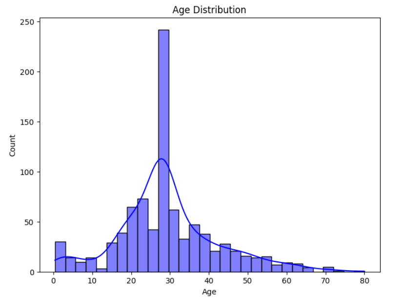
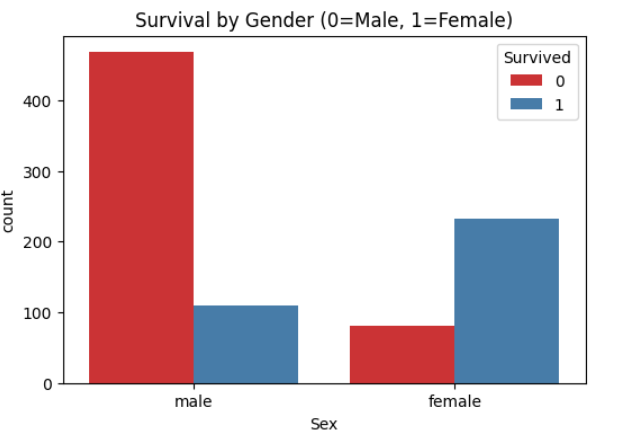
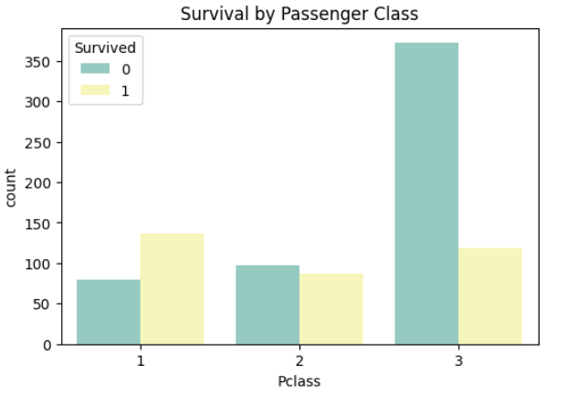
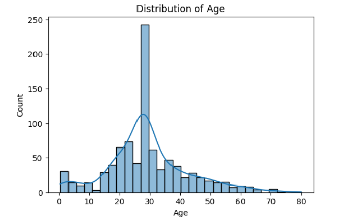

# 🚢 Titanic Data Analysis and Preprocessing

## 📌 Project Overview
This project focuses on analyzing and preprocessing the Titanic passenger dataset to understand factors influencing survival and prepare the data for predictive modeling. It involves cleaning the dataset, performing exploratory data analysis (EDA), feature engineering, and transforming data to make it suitable for machine learning algorithms.

## Key Objectives
- **Data Understanding**: Explore dataset structure, features, and target variable (`Survived`).
- **Data Cleaning & Preprocessing**: Handle missing values, duplicates, and encode categorical features.
- **Exploratory Data Analysis (EDA)**: Visualize patterns and relationships using bar charts, histograms, violin plots, and boxplots.
- **Feature Engineering**: Create meaningful features (e.g., family size, title extraction) and select relevant attributes.
- **Preparation for Modeling**: Split data into training and testing sets, ensuring clean, usable data for predictive modeling.

## 📂 Dataset
The dataset used is the Titanic passenger dataset, available from [Titanic Dataset](https://www.kaggle.com/datasets/yasserh/titanic-dataset)). It contains information such as:

- PassengerId
- Survived (target variable)
- Pclass (Passenger class)
- Name
- Sex
- Age
- SibSp (siblings/spouses aboard)
- Parch (parents/children aboard)
- Ticket
- Fare
- Cabin
- Embarked (Port of Embarkation)

## Data Preprocessing Steps
1. Handle missing values (e.g., fill missing Age with median, drop missing Embarked).
2. Encode categorical variables (Sex, Embarked) using label or one-hot encoding.
3. Create new features (e.g., FamilySize = SibSp + Parch + 1, Title from Name).
4. Drop irrelevant columns (e.g., Ticket, Cabin) or transform them as needed.
5. Scale or normalize numerical features if required.

## Exploratory Data Analysis (EDA)
Visualizations help understand data distribution and feature relationships:

- **Survival Distribution**  
  

- **Survival by Gender**  
  

- **Survival by Passenger Class**  
  

- **Age Distribution of Passengers**  
  

## Technologies Used
- **Python**
- **Pandas** – Data manipulation and preprocessing
- **NumPy** – Numerical computations
- **Matplotlib & Seaborn** – Data visualization
- **Jupyter Notebook** – Interactive coding environment

---

## How to Run
1. Clone the repository:
   ```bash
   git clone https://github.com/your-username/titanic-data-analysis.git


## 🎯 Objectives
- Clean and preprocess Titanic dataset  
- Handle missing values & categorical encoding  
- Perform Exploratory Data Analysis (EDA)  
- Visualize trends in survival by **gender, age, class, fare, embarkation**  
- Build machine learning models to predict survival  


## 🛠️ Technologies & Libraries Used
- **Language:** Python 3  
- **Libraries:**
  - Data Handling → `pandas`, `numpy`
  - Visualization → `matplotlib`, `seaborn`
  - Machine Learning (optional) → `scikit-learn`

## 🔄 Data Preprocessing
Steps performed:
1. Handling **missing values** (Age, Cabin, Embarked)  
2. Encoding **categorical features** (Sex, Embarked)  
3. Creating new **features** (Family Size, Title, etc.)  
4. Scaling and normalizing numerical features  

## 📊 Exploratory Data Analysis (EDA)
Some insights discovered:
- **Gender:** Women had a much higher survival rate than men.  
- **Class:** Passengers in **1st class** survived more compared to 3rd class.  
- **Age:** Children had a higher chance of survival than adults.  
- **Embarkation Point:** Passengers from port "C" had higher survival rates.  

### Example Visualizations
- Bar plots of survival by gender and class  
- Violin plots for age distribution across classes  
- Heatmaps of feature correlations  

(Add screenshots of your graphs here 👇)  


## Machine learning Models
- **Logistic Regression:** Predicts survival using a linear combination of features.  
- **Decision Tree:** Classifies passengers based on feature splits like age, sex, and class.  
- **Random Forest:** Ensemble model improving accuracy by combining multiple decision trees.  
- **K-Nearest Neighbors (KNN):** Predicts survival based on the majority class of nearest passengers.  
- Model performance (Accuracy, Precision, Recall, F1-score)

